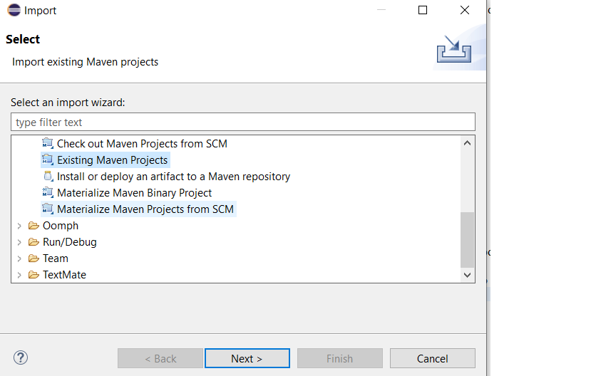
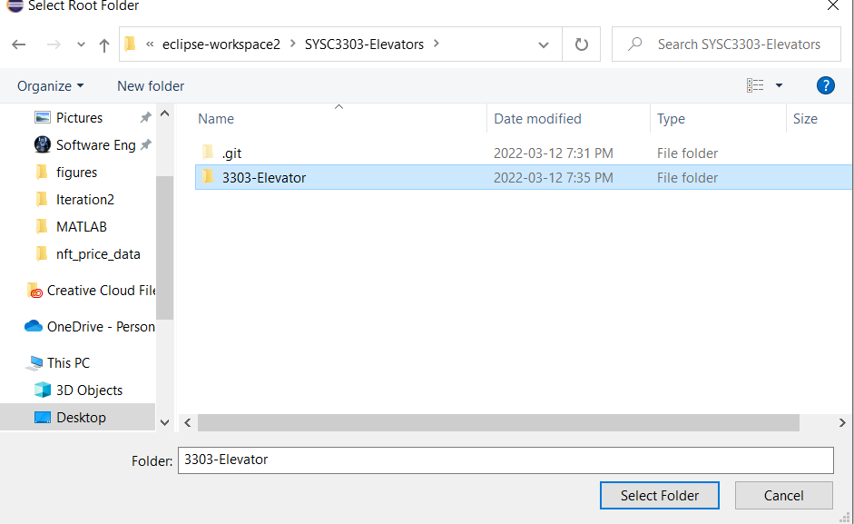
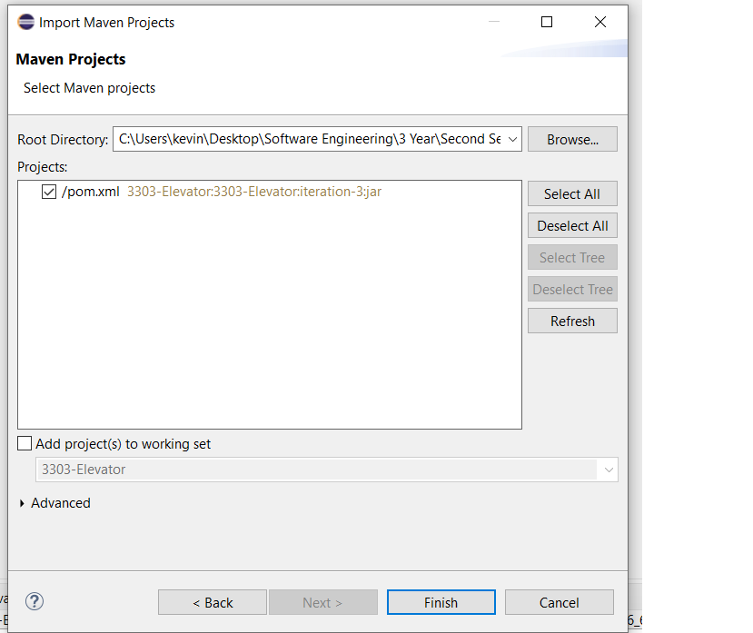

# Iteration 3 - SYSC 3303 - The Schedulators

# ProtoBuf Success

## Issues to address
- #### Iteration 1 issues
- ~~How will we interface with the ElevatorButton's?~~  completed (External, Internal buttons)
- ~~Scheduler will now need to handle a wider array of commands. Command will need to be broken down into multiple Classes for each type of command.~~ Completed 
- ~~How will the movement be handled with the new Motor class?~~  Completed
- ~~How will ElevatorFloorSensor detect the location of the elevator in the shaft?~~ Completed
- ~~We might need a new type of class Message to notify other components in the system of changes.~~ -Completed

<br />

- #### Iteration 2 issues
- ~~How to smoothly transition between new commands~~ complete
- ~~When trying internal button presses 1 floor below~~ completed

<br />

- #### Iteration 3 issues
- Dealing with nonsequential floors
- Bug when scheduling with 1 elevator only (Overwrites current destination) 


## Installation
 Warning this project needs JDK 17

1. Export the Project into the destination of your workspace so that you can easily import as Maven
2. Import Project using maven -> Exsiting maven projects
3. Navigate to the exported project and select the 3303-project folder and make sure to select the pom.xml






or

Git Clone the Project

```bash
git clone https://github.com/MG4CE/SYSC3303-Elevators.git
```


## Usage

### Run Maven Project Program From IDE

```java
 1. Right-click and Run Scheduler.java
 2. Right-click and Run # instances of Elevator.java
 3. Right-click and Run FloorSubsystem.java
 2. Profit
```

### Run Java Jar
```java 
Opening the 3303-Iteration-2-jar-with-dependencies.jar in terminal
1. Open the folder in a terminal
2. Java -jar 3303-Iteration-2-jar-with-dependencies.jar

```

### Run Java Tests

```java
 1. Right-click the test package in the package explorer
 2. Run As -> JUnit Test
```


## Folders & File Description

### ElevatorCommands 

- Folder holding all command types for sending information through the 3 components
- All Commands were generated using Googles - Google protobuf
- A skeleton file is compiled using Google Protobuf compiler which generated the following files
##### Files
  - #### Button.java -
    - Generated enum that holds the type of button it is Exterior / Interior
- #### Direction.java -
    - Generated enum that holds the direction of an elevator request Up / Down / Idle
- ##### LampState.java - 
    - Generate Enum that holds the lamp state On / OFF
   - ##### Google Protoc Compiled Message files
     - ElevatorArrivedMessage.java
     - ElevatorArrivedMessageOrBuilder.java
     - ElevatorCommandProtos.java
     - ElevatorDepartureMessage.java
     - ElevatorDepartureMessageOrBuilder.java
     - ElevatorRegisterMessage.java
     - ElevatorRegisterMessageOrBuilder.java
     - ElevatorRequestMessage.java
     - ElevatorRequestMessageOrBuilder.java
     - FloorSensorMessage.java
     - FloorSensorMessageOrBuilder.java
     - LampMessage.java
     - LampMessageOrBuilder.java
     - SchedulerDispatchMessage.java
     - SchedulerDispatchMessageOrBuilder.java  
     - WrapperMessage.java
     - WrapperMessageOrBuilder.java
  <br />
  <br />

### Elevator.java

- The Elevator that holds a Finite State Machine which holds states of what the elevator is doing.
- The elevator will listen for commands from the scheduler.java
    ##### States
    - IDLE - Waiting for scheduler request
    - BOARDING - Waiting at floor for Internal Button request or for passengers to leave
    - MOVING - The elevator is traveling from A floor to another
    - ARRIVING - The elevator is 1 floor before the destination and will slow down 

- These States are to implement the FSM below

### Scheduler.java

- The scheduler implements a FSM that goes between a dispatch and Wait state
    - Dispatch - Send a command to the elevator
    - Wait - do nothing

- The scheduler dispatches elevator requests to the elevator using the SCAN Algorithm


- Holds 3 lists 
    - Elevator up list - Holds up requests
    - Elevator down list - Holds down requests
    - Commands to dispatch - Holds commands to send to the elevator in the current direction


- FloorSubsystem will send ExternalFloorBtnCommands
- Elevator will send InternalFloorBtnCommands


### FloorSubsystem.java

- Reads input commands from input.txt
- Parses the calling floor into an ExternalFloorBtnCommand send to the scheduler
- Once that command is completed by the elevator then the system will call 
```java-
Elevator.PushButton(Destination floor)
```
- Once all commands are pushed to the Queue then a stop command will be added to the Queue
  <br />

```java
//Stop command shown below
"0:0:0.0", -1, "up", -1
```
 


### input.txt

- Holds all the test commands to be read by the Floorsubsystem
- Each line is shown in the format below

```java
 "time(HH:mm:ss.ms) floor direction selected floor"
 //Example
//Time Floor Direction selectedFloor
00:01:00.1 1 Up 1
00:02:00.1 1 Up 2
00:03:00.1 1 Up 3
```

## Team & Contributions

1. Maged - Scheduler.java, Elevator.java ,UML 
2. Ehvan - ProtoBuf Messages, Elevator.java, Scheduler.java, UML  
3. Golan - Scheduler.java, Elevator.java
4. Rodrigo - Subsystem.java, Scheduler.java
5. Kevin - Test, Elevator.java, UML, ReadMe
