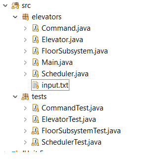
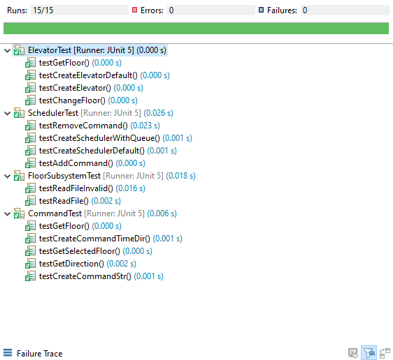

# Iteration 2 - SYSC 3303 - The Schedulators

## Issues to address
- #### Iteration 1 issues
- ~~How will we interface with the ElevatorButton's?~~  completed (External, Internal buttons)
- ~~Scheduler will now need to handle a wider array of commands. Command will need to be broken down into multiple Class for each type of command.~~ Completed 
- ~~How will movement be handled with the new Motor class?~~  Completed
- ~~How will ElevatorFloorSensor detect the location of the elevator in the shaft?~~ Completed
- ~~We might need a new type of class Message to notify other components  in the system of changes.~~ -Completed

<br />

- #### Iteration 2 issues
- How to smoothly transition between new commands
- When trying internal button presses 1 floor below 


## Installation

Import the Iteration 3 project into your IDE.

or

Git Clone the Project

```bash
git clone https://github.com/MG4CE/SYSC3303-Elevators.git
```

The following image should show an example of the src files in the package view



## Usage

### Run Main Program

```java
 1. Run the main method in Main.java
 2. Right-click the Main.java file
 3. Run As -> Java Application
 2. Profit
```

### Run Java Tests

```java
 1. Right-click the test package in the package explorer
 2. Run As -> JUnit Test
```

#### Output



## Files & Description

### Command.java

- Holds Information about elevator commands that will be sent from the Floor to the Scheduler
##### Subclasses

  - ##### ElevatorArrivedMessage.java - 
    - This is a message from elevator to scheduler for elevator arriving at destination floor
   - ##### ElevatorDispatchCommand.java
        - This is a command from the scheduler to elevator to command elevator to go to a floor  
   - ##### ElevatorFloorSensorMessage.java
        - This is a message from the floor sensor to tell the elevator it made it to a floor
   - ##### ElevatorMovingMessage.java
       - This is a message to tell the scheduler that the elevator started to move to a floor 
   - ##### ExternalFloorBtnCommand.java
        - This is a command from a floor to scheduler that the elevator is requested. It will   also be dispatched to the elevator    
   - ##### FloorDirectionLampMessage.java
        - This message is from elevator to scheduler to floor to show that the elevator is going in that direction 
   - ##### InteriorElevatorBtnCommand.java
        - This is a command from elevator to scheduler that will tell the scheduler that the floor was requested from someeone in the elevator. 
        -  This will be simulated by the floor subsystem calling pushbutton in the Elevator 
   - ##### MotorMessage.java
        - This is a message from the motor to the elevator that it made it to the next floor by sending current floor height. Each floor is 4 metres difference.
 
  <br />
  <br />

### Elevator.java

- The Elevator that holds a Finite State Machine which holds states of what the elevator is doing.
- The elevator will listen for commands from the scheduler.java
    ##### States
    - IDLE - Waiting for scheduler request
    - BOARDING - Waiting at floor for Internal Button request or for passengers to leave
    - MOVING - The elevator is traveling from A floor to another
    - ARRIVING - The elevator is 1 floor before the destination and will slow down 

- These States are to implement the FSM below


 

#### Elevator Components
  - ##### ArrivalSensor.java - 
    - This is used to determine which floor the motor has gone past
   - ##### Door.java
        - Elevator door that can open and close
   - ##### ElevatorButton.java
       - A button that is inside the elevator, the elevator holds a list of buttons * max floors
   - ##### ElevatorButtonLamp.java
        - THe light on each elevator button that will light up once it has been pressed 
   - ##### Motor.java
        - The motor that simulates moving the elevator. It sends MotorMessages to the elevator to tell that it past a floor
 


  <br />
  <br />

### FloorSubsystem.java

- Reads input commands from input.txt
- Parses the calling floor into an ExternalFloorBtnCommand send to the scheduler
- Once that command is completed by the elevator then the system will call 
```java-
Elevator.PushButton(Destination floor)
```
- Once all commands are pushed to the Queue then a stop command will be added to the Queue
  <br />

```java
//Stop command shown below
"0:0:0.0", -1, "up", -1
```

#### FloorSubSystem Components
 - ##### Floor.java - 
    - Each floor of the system
 - ##### FloorButton.java
    - The buttons that will control calling an elevator
 - ##### FloorButtonLamo.java
    - The light on each floor button that will light up once it has been pressed 

<br />

### Shared Componenents 
##### Between Floor and Elevator
- ##### DirectionLamp.java 
    - The lamp that shows up or down on each floor and inside the elevator
 
  <br />

### Main.java

- Runs the main method
- Creates
  - FloorSubsytem thread
  - Scheduler Thread
  - Elevator Thread


### Scheduler.java

- The scheduler implements a FSM that goes between a dispatch and Wait state
    - Dispatch - Send a command to the elevator
    - Wait - do nothing

- The scheduler dispatches elevator requests to the elevator using the SCAN Algorithm


- Holds 3 lists 
    - Elevator up list - Holds up requests
    - Elevator down list - Holds down requests
    - Commands to dispatch - Holds commands to send to the elevator in the current direction


- FloorSubsystem will send ExternalFloorBtnCommands
- Elevator will send InternalFloorBtnCommands

<br />

### input.txt

- Holds all the test commands to be read by the Floorsubsystem
- Each line is shown in the format below

```java
 "time(HH:mm:ss.ms) floor direction selected floor"
 //Example
//Time Floor Direction selectedFloor
00:01:00.1 1 Up 1
00:02:00.1 1 Up 2
00:03:00.1 1 Up 3
```

## Team & Contributions

1. Maged -  All Commands, Subcomponents, UML <3
2. Ehvan - Elevator.java, Scheduler.java, Tests  
3. Golan - Scheduler.java, Elevator.java
4. Rodrigo - FloorSubsystem.java, Commands
5. Kevin - Elevator.java, Scheduler.java, ReadMe
